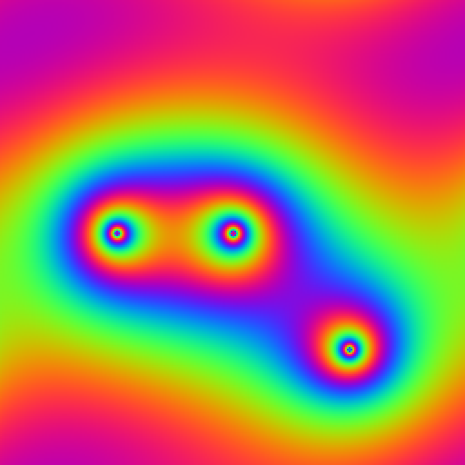

# gravity-js
Gravity simulation using laplacian and FFT solver written in javascript, and winh browser visualization.

# Introduction
Newtonain gravity can be solved by solving a gravitational field equation.

this is a poisson equation which can be solved numerically using an FFT.

->  <-

# solver

# render
